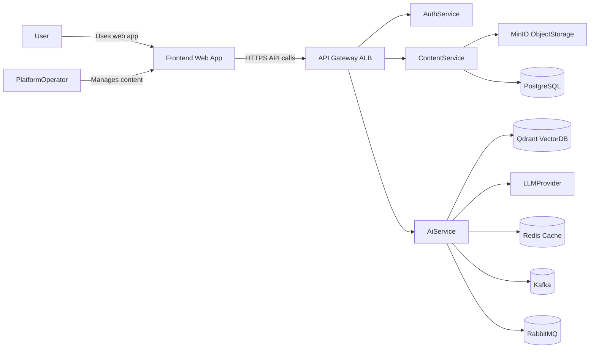
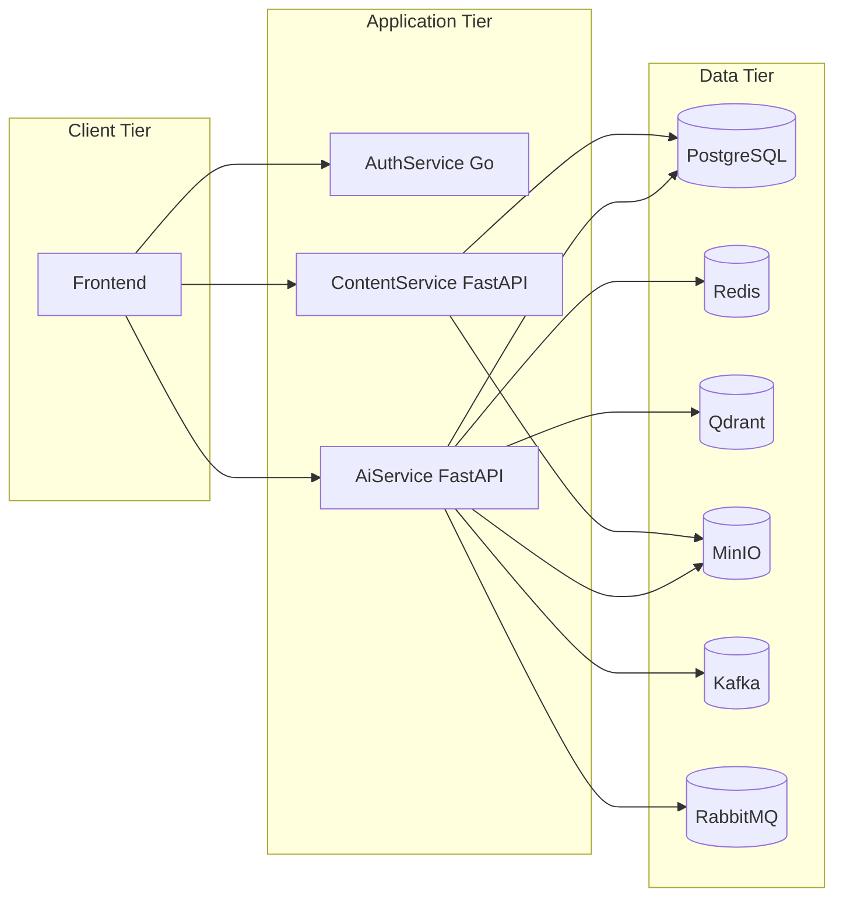
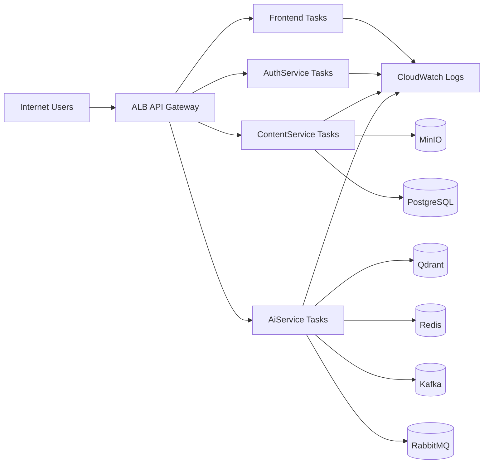
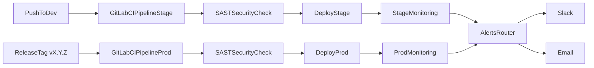

# Architecture Vision Document (AVD)

## Driver
- Beket Nurzhanov

## Approver
- Beket Nurzhanov

## Contributors
- Beket Nurzhanov
- Abylaikhan Shokanuly 
- Aibar Tlekbay 
- Dinmukhammed Ablaiuly 

## Informed
- Beket Nurzhanov

## Objective
- Develop and present an AI-powered educational platform version with multilingual support, analytics, data protection, and scalable microservices architecture for lecture-based learning.

## Status
- In Progress

## Execution Summary
- The platform provides secure lecture management, AI-powered summaries and quizzes, and RAG-based chat over lecture data.
- Architecture is designed as microservices: `auth-service` (Go), `content-service` (FastAPI), `ai-service` (FastAPI), and `frontend` (React/Next.js).
- Core data layer combines PostgreSQL, Redis, MinIO object storage, vector DB (Qdrant), and message brokers (Kafka, RabbitMQ) to support transactional, cached, semantic, and async workloads.
- Deployment targets AWS with HTTPS-first networking, observability, and CI/CD automation.

## High-Level Description
- This project is an AI-powered educational platform that lets users upload lectures (PDF/audio), browse lecture content, chat with AI using RAG, generate summaries, and create quizzes.
- Users consume content and AI features, while platform operators manage content lifecycle and platform operations.
- The platform addresses fragmented study materials and low learning efficiency by centralizing content and automating learning artifacts.

## Key Decisions
- Microservices over monolith for domain isolation and independent scaling.
- AI capabilities are provided through a dedicated AI service to decouple business logic from model orchestration.
- JWT-based authentication with access/refresh token model.
- Vector retrieval via Qdrant for RAG context selection.
- MinIO is used as object storage for lecture files and generated artifacts.
- API-first contracts between frontend and backend services.
- Event-driven async processing for heavy AI tasks (indexing, long summaries, audio generation).
- Kafka is used for indexing API event flow.
- RabbitMQ is used for agent (RAG) invocation flow.

## Key Risks
- Low-quality source lecture files can reduce retrieval quality.
  - Mitigation: preprocessing, normalization, chunking strategy, ingestion validation.
- AI response latency can degrade user experience.
  - Mitigation: caching, prompt constraints, async workflows with job tracking.
- Rapid usage growth can pressure vector and AI inference layers.
  - Mitigation: horizontal autoscaling and queue-based workload smoothing.
- Data privacy risks for uploaded educational content.
  - Mitigation: encryption in transit/at rest, strict RBAC, audit trails.

## Architectural Drivers

### Business Goals
- Improve user learning efficiency with searchable and interactive lecture knowledge.
- Reduce manual effort for summary and quiz creation.
- Provide scalable architecture for future user and content growth.
- Ensure secure and compliant handling of educational data.

### Major Features
- Secure registration/login and profile stats.
- Lecture CRUD and metadata/content access.
- Lecture-to-vector ingestion workflow.
- RAG chat with context-aware responses.
- Summary generation and quiz generation per lecture.

### Design Constraints
- Initial target: up to 10 concurrent users in prototype stage, extensible to 100 users.
- Cost efficiency: prioritize managed/open-source services with clear scaling limits.
- Security by design: encrypted transport and storage, token-based auth.
- Modularity: independent deployment of services.

### Architectural Concerns
- AI inference latency and throughput.
- Search relevance and chunk quality in vector DB.
- API consistency across services.
- Observability for distributed tracing and incident response.

## Quality Attributes and Quality Attribute Scenarios

### Security
- Attribute: all external/internal traffic is HTTPS; sensitive data is encrypted at rest.
- Scenario: when an unauthorized token accesses lecture content, API returns `401/403`, and event is logged for audit.

### RBAC (Minimal Policy)
- Access model: authenticated users + restricted operator actions.
- Authenticated users: read existing lecture content and use own chat interactions with AI.
- Restricted operator actions: content upload/update/delete and AI generation triggers.
- Access rule: user chat access is limited to own chats.

### Performance
- Attribute: average interactive operations return within acceptable UX thresholds.
- Scenario: under 10 concurrent active users, RAG chat responds within target SLA through caching and retrieval optimization.

### Availability and Reliability
- Attribute: service-level high availability with fault isolation.
- Scenario: if `ai-service` pod/task fails, orchestrator replaces instance without affecting auth/content service availability.

### Scalability
- Attribute: horizontal scaling of stateless services.
- Scenario: during exam periods, chatbot and quiz traffic spikes are handled by independently scaling `ai-service`.

### Usability
- Attribute: streamlined, low-friction user workflow.
- Scenario: a platform operator uploads a lecture, then a user reads content and starts RAG chat in a single guided flow.

## Solution Architectures

### System Context View
- Actors:
  - User: consumes lecture content and AI learning outputs.
  - Platform Operator: manages lecture content quality and platform operations.
  - External AI provider/model runtime: executes language tasks.
  - Cloud infrastructure: hosts services, storage, and monitoring stack.



### Container View
- `frontend` (React/Next.js):
  - UI routing, auth token handling, lecture/AI workflows.
- `auth-service` (Go):
  - registration, login, refresh, logout, identity and role claims.
- `content-service` (FastAPI):
  - lecture metadata/content CRUD, file lifecycle, lecture listing and retrieval.
- `ai-service` (FastAPI):
  - vector indexing, RAG orchestration, summary/quiz generation.
  - publishes indexing tasks to Kafka and invokes RAG agent flow via RabbitMQ.
- Data containers:
  - PostgreSQL for users, lecture metadata, quiz results.
  - Redis for cache/session acceleration.
  - Qdrant for embeddings and semantic retrieval.
  - MinIO object storage for uploaded lecture files and generated artifacts.
  - Kafka for indexing pipeline events.
  - RabbitMQ for RAG agent request/response messaging.



### Deployment View
- Environments: `stage` and `prod`.
- Compute: containerized services on ECS/EKS/EC2-based orchestrated runtime.
- Networking:
  - Public ingress via ALB/API gateway.
  - Private service/data subnets.
  - Security groups with least privilege.
- Security:
  - TLS everywhere.
  - Secret management for DB and API credentials.
  - Audit logging enabled.



## Service API Catalog

### API Governance
- Base URL: `/api/v1`
- Auth: `Authorization: Bearer <access_token>` for protected endpoints.
- Token model: short-lived access token + refresh token.
- Common error envelope:
```json
{
  "error": {
    "code": "RESOURCE_NOT_FOUND",
    "message": "Lecture not found",
    "request_id": "req_12345"
  }
}
```

### API Access Matrix (Public / Authenticated / Restricted)
- Auth endpoints:
  - `POST /api/v1/auth/register`: public
  - `POST /api/v1/auth/login`: public
  - `POST /api/v1/auth/refresh`: authenticated
  - `POST /api/v1/auth/logout`: authenticated
  - `GET /api/v1/auth/me`: authenticated
- Content endpoints:
  - `POST /api/v1/lectures`: restricted (platform operator)
  - `PATCH /api/v1/lectures/{lecture_id}`: restricted (platform operator)
  - `DELETE /api/v1/lectures/{lecture_id}`: restricted (platform operator)
  - `GET /api/v1/lectures`: authenticated (read-only)
  - `GET /api/v1/lectures/{lecture_id}/content`: authenticated (read-only)
- AI endpoints:
  - `POST /api/v1/ai/lectures/{lecture_id}/index`: restricted (platform operator)
  - `POST /api/v1/ai/lectures/{lecture_id}/summaries`: restricted (platform operator)
  - `POST /api/v1/ai/lectures/{lecture_id}/quizzes`: restricted (platform operator)
  - `POST /api/v1/ai/chat/rag`: authenticated
- Ownership rule for chats:
  - `user` can access only own chats/messages (`chats.user_id == token.user_id`).

### Auth Service APIs

#### `POST /api/v1/auth/register`
- Purpose: register a new user.
- Request:
```json
{
  "email": "user@example.com",
  "password": "StrongPass123!",
  "first_name": "Alex",
  "last_name": "User"
}
```
- Response `201`:
```json
{
  "user_id": "usr_001",
  "email": "user@example.com",
  "first_name": "Alex",
  "last_name": "User"
}
```

#### `POST /api/v1/auth/login`
- Purpose: authenticate and issue tokens.
- Request:
```json
{
  "email": "user@example.com",
  "password": "StrongPass123!"
}
```
- Response `200`:
```json
{
  "access_token": "jwt_access",
  "refresh_token": "jwt_refresh",
  "expires_in": 900,
  "token_type": "Bearer"
}
```

#### `POST /api/v1/auth/refresh`
- Purpose: rotate access token using refresh token.
- Request:
```json
{
  "refresh_token": "jwt_refresh"
}
```
- Response `200`:
```json
{
  "access_token": "jwt_access_new",
  "expires_in": 900,
  "token_type": "Bearer"
}
```

#### `POST /api/v1/auth/logout`
- Purpose: revoke refresh token/session.
- Response `204`.

#### `GET /api/v1/auth/me`
- Purpose: fetch current user profile.
- Response `200`:
```json
{
  "user_id": "usr_001",
  "email": "user@example.com",
  "first_name": "Alex",
  "last_name": "User"
}
```

### Content Service APIs

#### `POST /api/v1/lectures` (Add Lecture)
- Purpose: create lecture metadata and upload link/object reference.
- Request:
```json
{
  "lecture_title": "Linear Algebra Lecture 1",
  "file_key": "uploads/lecture1.pdf"
}
```
- Response `201`:
```json
{
  "lecture_id": "lec_1001",
  "user_id": "usr_001",
  "lecture_title": "Linear Algebra Lecture 1",
  "file_key": "uploads/lecture1.pdf",
  "created_date": 1771755300,
  "deleted": 0
}
```

#### `DELETE /api/v1/lectures/{lecture_id}` (Delete Lecture)
- Purpose: delete lecture metadata and related assets policy-dependently.
- Response `204`.

#### `PATCH /api/v1/lectures/{lecture_id}` (Change Lecture Name)
- Purpose: rename lecture title.
- Request:
```json
{
  "lecture_title": "Linear Algebra Lecture 1 - Updated"
}
```
- Response `200`:
```json
{
  "lecture_id": "lec_1001",
  "lecture_title": "Linear Algebra Lecture 1 - Updated"
}
```

#### `GET /api/v1/lectures/{lecture_id}/content` (Get Lecture Content)
- Purpose: retrieve parsed lecture text/content pointers.
- Response `200`:
```json
{
  "lecture_id": "lec_1001",
  "lecture_title": "Linear Algebra Lecture 1 - Updated",
  "file_key": "uploads/lecture1.pdf",
  "content": [
    {
      "section_id": "s1",
      "text": "A matrix is a rectangular array of numbers..."
    }
  ]
}
```

#### `GET /api/v1/lectures` (List Lectures)
- Purpose: list user-accessible lectures with pagination/filtering.
- Query params: `page`, `limit`, `search`.
- Response `200`:
```json
{
  "items": [
    {
      "lecture_id": "lec_1001",
      "user_id": "usr_001",
      "lecture_title": "Linear Algebra Lecture 1 - Updated",
      "file_key": "uploads/lecture1.pdf",
      "created_date": 1771755300,
      "deleted": 0
    }
  ],
  "page": 1,
  "limit": 20,
  "total": 1
}
```

### AI Service APIs

#### `POST /api/v1/ai/lectures/{lecture_id}/index` (Upload Lecture to Vector DB)
- Purpose: trigger ingest/chunk/embed/index pipeline for one lecture.
- Implementation note: API publishes indexing event to Kafka; workers process and update job status.
- Request:
```json
{
  "reindex": false,
  "chunk_size": 800,
  "chunk_overlap": 120
}
```
- Response `202`:
```json
{
  "job_id": "job_idx_009",
  "lecture_id": "lec_1001",
  "status": "queued"
}
```

#### `POST /api/v1/ai/chat/rag` (Chat with AI RAG)
- Purpose: ask lecture-aware question and get grounded answer.
- Implementation note: API uses RabbitMQ to invoke agent workflow and return grounded response.
- Request:
```json
{
  "chat_id": "chat_123",
  "content": {
    "text": "Explain matrix rank in simple terms"
  },
  "source": "web"
}
```
- Response `200`:
```json
{
  "message_id": "msg_456",
  "chat_id": "chat_123",
  "is_user": false,
  "content": {
    "text": "Matrix rank is the number of linearly independent rows or columns...",
    "source_documents": ["c_42", "c_17"]
  },
  "source": "script",
  "created_date": "2026-02-22T10:15:00Z"
}
```

#### `POST /api/v1/ai/lectures/{lecture_id}/summaries` (Summarize Lecture)
- Purpose: generate concise or detailed lecture summary.
- Request:
```json
{
  "mode": "short",
  "language": "en",
  "max_tokens": 600
}
```
- Response `200`:
```json
{
  "lecture_id": "lec_1001",
  "summary": "This lecture introduces matrices, rank, and linear dependence..."
}
```

#### `POST /api/v1/ai/lectures/{lecture_id}/quizzes` (Create Quiz for Lecture)
- Purpose: generate quiz set from lecture content.
- Request:
```json
{
  "difficulty": "medium",
  "question_count": 10,
  "language": "en",
  "format": "mcq"
}
```
- Response `200`:
```json
{
  "lecture_id": "lec_1001",
  "quiz_id": "quiz_220",
  "questions": [
    {
      "id": "q1",
      "text": "What does matrix rank represent?",
      "options": ["Rows count", "Independent vectors count", "Trace value", "Determinant sign"],
      "answer": 1
    }
  ]
}

```

### Frontend API Integration Contract
- Frontend calls backend through gateway under `/api/v1`.
- Auth flows:
  - Login/register pages call auth APIs, tokens stored with secure strategy.
- Lecture flows:
  - Lecture dashboard uses list/get/add/delete/rename endpoints.
- AI flows:
  - Lecture details page invokes indexing, summary, quiz, and RAG chat endpoints.

## Logs / Monitoring / Alerting / CI/CD

### Logs
- Structured JSON logs with `request_id`, `user_id`, `service`, `latency_ms`, `error_code`.
- Centralized ingestion from all services into cloud log platform.
- Audit logs for authentication events and privileged actions.

### Monitoring
- API metrics: request rate, latency percentiles, error rate.
- Service metrics: CPU, memory, restart count, queue depth.
- AI metrics: model latency, token usage, retrieval hit quality, job durations.
- Data metrics: DB connection saturation, cache hit rate, vector index health.

### Alerting
- Severity-based alert policies:
  - Critical: auth outage, gateway 5xx spikes, DB unavailability.
  - High: AI latency breach, indexing job backlog.
  - Medium: elevated retries and error trends.
- Alert channels: Slack/email/on-call routing.

### CI/CD
- Branch strategy:
  - `dev` -> auto deploy to stage.
  - release tags `vX.Y.Z` -> deploy to production.
- Pipeline steps:
  - Lint, test, SAST, build image, push registry, deploy IaC/application, post-deploy health checks.



## Implementation Roadmap
- Phase 1: Foundation
  - Setup repos, service skeletons, auth baseline, DB schemas.
- Phase 2: Content Domain
  - Implement lecture CRUD, storage integration, listing and retrieval.
- Phase 3: AI Domain
  - Implement indexing pipeline, RAG chat, summary and quiz generation.
- Phase 4: Frontend Integration
  - End-to-end user flows for auth, lecture management, and AI actions.
- Phase 5: Reliability and Scale
  - Observability hardening, performance tuning, autoscaling, security review.

## Technology Stack

### Client Applications
- React or Next.js, TypeScript, responsive web UI, multilingual-ready frontend.

### Server Application
- `auth-service`: Go.
- `content-service`: FastAPI (Python).
- `ai-service`: FastAPI (Python).
- REST APIs over HTTPS, JWT auth model.

### AI/ML and Search
- LLM provider integration for generation tasks.
- Qdrant vector DB for semantic retrieval.

### Data and Storage
- PostgreSQL for transactional data.
- Redis for caching.
- MinIO object storage for lecture assets and generated outputs.

### Messaging and Async
- Kafka for indexing API asynchronous event flow.
- RabbitMQ for RAG agent invocation and response flow.

### Security, Observability, Reliability
- HTTPS, JWT, RBAC, secret management.
- Centralized logs, metrics dashboards, and alerting policies.
- Container orchestration with autoscaling support.

## Team Structure

### Business and Management
- Product Owner: vision, priorities, acceptance.
- Project Manager: planning, communication, risk tracking.

### Architecture and Security
- Solution Architect: target architecture, NFR alignment.
- Security Engineer: IAM, encryption, auth hardening, audits.

### Engineering
- Backend Engineer (Auth): identity, tokens, user profile endpoints.
- Backend Engineer (Content): lecture APIs, storage lifecycle.
- AI Engineer: embeddings, RAG orchestration, generation quality.
- Frontend Engineer: user flows and API integration.

### Reliability and Quality
- DevOps Engineer: IaC, CI/CD, runtime operations.
- QA Engineer: functional, performance, and security validation.

## Appendix
- AWS Architecture Reference Diagrams:
  - https://aws.amazon.com/architecture/reference-architecture-diagrams/
- Architecture Vision Document reference session:
  - https://www.youtube.com/live/iL2Vpx8Qocs?si=5o0fYXH-Y_UQiCxW&t=4448

