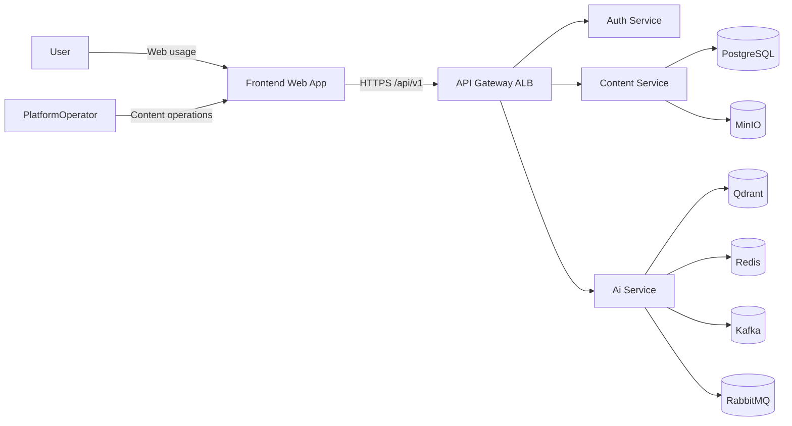

# Business Requirements Document (BRD)

## Document Name
Business Requirements Document (BRD)

## Project Name
AI-Powered Educational Platform for Lectures, Summaries, and Quizzes

## Driver
- Beket Nurzhanov

## Approver
- Beket Nurzhanov

## Contributors
- Beket Nurzhanov
- Abylaikhan Shokanuly
- Aibar Tlekbay
- Dinmukhammed Ablaiuly

## Informed
- Project team and academic supervisors

## Objective
Define the business requirements, scope, constraints, and success criteria for the university MVP of an educational platform that centralizes lecture content and supports AI-assisted learning workflows.

## Key outcomes
- Unified access to lecture materials via web.
- AI-powered Q&A (RAG), summaries, and quizzes.
- Minimal access model for practical operational control.
- Production-like architecture suitable for future scale-up.

## BRD Status
in review

## Version
v1.0

## 1. Business Requirements (Бизнес-требования)

### 1.1. Needs Statement (Формулировка потребности)
Students and learners often receive lecture materials in scattered formats (PDF/audio/notes), which makes retrieval and revision slow and inefficient. Instructors and content teams spend extra time preparing summaries and quizzes manually. The project is needed to reduce this overhead by providing a centralized content workflow and AI-assisted study features in one platform.

### 1.2. Business Goals (Цели бизнеса)
- Improve learning efficiency through searchable lecture content.
- Reduce manual effort in creating summaries and quizzes.
- Provide role-based access with clear operational boundaries.
- Deliver a pilot that can be scaled with the same architecture.

### 1.3. Key Objectives (Ключевые задачи)
1.3.1. Implement secure authentication and session lifecycle.
1.3.2. Implement lecture content management APIs and storage lifecycle.
1.3.3. Implement AI workflows: indexing, RAG chat, summary generation, quiz generation.
1.3.4. Provide frontend user flows for content browsing and AI interactions.
1.3.5. Establish observability baseline (logs, metrics, alerts).

### 1.4. Success Metrics (Метрики успеха)
1.4.1. Availability: >= 99.0% in pilot runtime window.
1.4.2. Non-AI API latency (P80): <= 3 seconds.
1.4.3. RAG response latency (P80): <= 10 seconds.
1.4.4. Protected endpoint coverage: 100% JWT-authenticated.
1.4.5. AI workflow completion (valid inputs): >= 90%.

## 2. Scope and Limitations (Область охвата и ограничения)

### 2.1. Scope (Область охвата)

#### 2.1.1. In-scope (Входит в рамки проекта)
2.1.1.1. User registration/login/refresh/logout/profile APIs.
2.1.1.2. Lecture CRUD/list/content retrieval APIs.
2.1.1.3. AI indexing endpoint and asynchronous processing.
2.1.1.4. RAG chat endpoint with source references.
2.1.1.5. Summary and quiz generation endpoints.
2.1.1.6. Frontend integration for auth/content/AI flows.
2.1.1.7. Basic monitoring and operational alerting.

#### 2.1.2. Out-of-scope (Не входит в рамки проекта)
2.1.2.1. Native mobile applications.
2.1.2.2. Large-scale nationwide rollout and enterprise hardening.
2.1.2.3. Custom model training/fine-tuning pipeline.
2.1.2.4. Full integration with all external education systems.

### 2.2. Stakeholders (Заинтересованные стороны)
| Stakeholder | Role / Interest |
|---|---|
| Product Owner / Academic Lead | Defines priorities and accepts outcomes |
| Engineering Team | Implements backend, AI, frontend, and ops |
| End Users (`user`) | Consume content and AI features |
| Platform Operators | Manage content lifecycle and platform operations |
| Supervisors / Reviewers | Validate quality, scope, and delivery evidence |

### 2.3. Business Constraints (Бизнес-ограничения)
2.3.1. Limited MVP timeline and team capacity.
2.3.2. Budget-conscious technology choices.
2.3.3. Pilot scope focused on web and selected integrations.
2.3.4. Security baseline required for all exposed APIs.

### 2.4. Assumptions (Предположения)
2.4.1. Cloud infrastructure and required access are available on time.
2.4.2. Pilot dataset of lecture materials is available.
2.4.3. AI provider and vector database are reachable in target environment.
2.4.4. Users will test and provide feedback during pilot.

### 2.5. Dependencies (Зависимости)
2.5.1. Architecture and API contract alignment across services.
2.5.2. Availability of PostgreSQL, Redis, Qdrant, MinIO.
2.5.3. Availability of Kafka and RabbitMQ for async workflows.
2.5.4. CI/CD and environment readiness (`stage`, `prod`).

## 3. Business Process Overview (Обзор бизнес-процессов)

### 3.1. As-Is Process (Текущее состояние)
3.1.1. Lecture materials are distributed across separate files/sources.
3.1.2. Search and revision are mostly manual.
3.1.3. Summaries and quizzes are created manually.
3.1.4. AI-assisted Q&A is unavailable or inconsistent.

### 3.2. To-Be Process (Будущее состояние)
3.2.1. Platform operator uploads and manages lecture materials in centralized storage.
3.2.2. Users browse and read lecture content through a unified interface.
3.2.3. AI service indexes lecture content into vector store.
3.2.4. Users ask questions in chat and receive grounded answers with sources.
3.2.5. Platform operator triggers summary/quiz generation for lecture materials.

## 4. Stakeholder Requirements (Требования стейкхолдеров)

### 4.1. Platform Users (`user`)
SR1. The system must allow users to register, log in, and maintain sessions securely.
SR2. The system must allow users to browse and read existing lecture content.
SR3. The system must allow users to chat with AI and receive source-grounded answers.
SR4. The system must allow users to access generated summaries and quizzes.
SR5. The system must restrict users from creating/updating/deleting lecture content.

### 4.2. Platform Operators
SR6. The system must allow platform operators to upload, update, and delete lecture content.
SR7. The system must allow platform operators to trigger indexing, summary, and quiz generation.
SR8. The system must provide platform operators with access to operational status and logs.
SR9. The system must enforce role-based permissions on all protected endpoints.
SR10. The system must preserve data integrity and auditability for privileged actions.

## 5. Context Diagram (Контекстная диаграмма)

## 6. Glossary of Terms (Глоссарий терминов)

6.1. RAG (Retrieval-Augmented Generation)  
AI approach where responses are generated using retrieved context from indexed data.

6.2. Vector DB (Qdrant)  
Database for storing embeddings and performing semantic similarity search.

6.3. MinIO  
S3-compatible object storage used for source lecture files and generated artifacts.

6.4. JWT  
Token format used for stateless authentication and authorization.

6.5. RBAC  
Access control model that separates regular users from restricted platform operations.